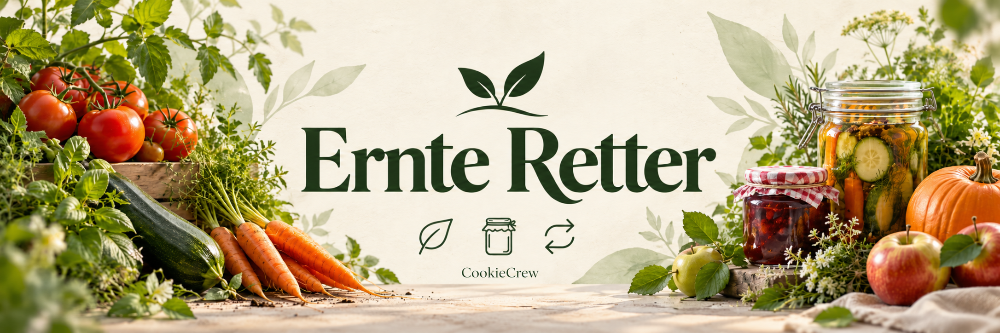

# 🌱 Ernte Retter – Ein Projekt der CookieCrew

## 📝 Projektbeschreibung

Dieses Repository enthält unser Abschlussprojekt **Ernte Retter**.

Die Idee ist aus meinem eigenen Gartenalltag entstanden: Man steckt viel Zeit und Herz in den Garten und plötzlich wird alles gleichzeitig reif. Wohin mit den ganzen Zucchini, Tomaten und dem Obst? Zum Wegwerfen ist die eigene Ernte einfach viel zu schade.

Unser Ziel ist es, eine Anwendung zu entwickeln, die dabei hilft, Ernte und Vorräte im Blick zu behalten, passende Rezepte zu finden und Obst und Gemüse haltbar zu machen. Eine Einmach-Fibel soll dabei Tipps und Wissen rund ums Haltbarmachen vermitteln.

Zusätzlich bauen wir einen Marktplatz, auf dem überschüssige Ernte angeboten und von anderen reserviert werden kann. Denn was bei einem zu viel ist, kann jemand anderes vielleicht gerade gut gebrauchen.

Den ursprünglich von mir entwickelten Ernte Retter bauen wir für unser Abschlussprojekt gemeinsam weiter aus – mit React, einem Python-Backend und Docker.

**Weniger verschwenden, mehr aus der eigenen Ernte machen und miteinander teilen.** 🌿

## 🍪 CookieCrew

Wir sind Bendix,Lee und Ramona und haben uns im Kurs Cloud-25-11 als Lerngruppe gefunden.

Nach unserem gemeinsamen Cookino Shop widmen wir uns nun dem Ernte Retter. Ein anderes Thema, aber mit genauso viel Herz, eigenen Ideen und dem Wunsch, gemeinsam etwas zu bauen, das auch im Alltag nützlich ist. ❤️

**📅 Wichtiger Termin:**  
Projektvorstellung: 21. Oktober 2026 

### Dokumentation
#### *7.Oktober*
* Thema finden
* Repo anlegen
* Features festlegen
* Besprechung wer macht was, ideen Sammlung

#### *8.Oktober*
######  Bendix:
  - Schreiben von docker-compose.yml, damit Frontend und Backend lokal als Container zusammen hochfahren 

######  Lee:
  - Backend Struktur gebaut

######  Ramona: 
  - Markplatz gebaut
  - Dokumentation
